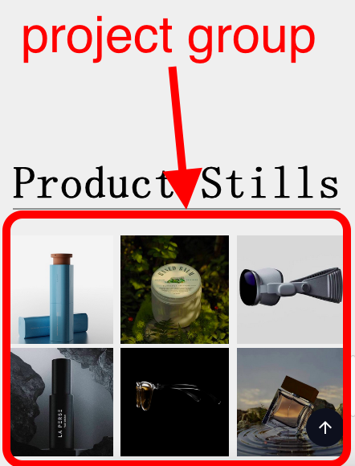
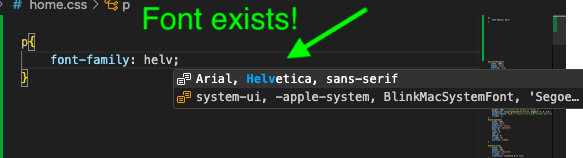
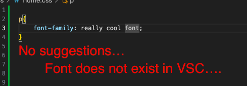
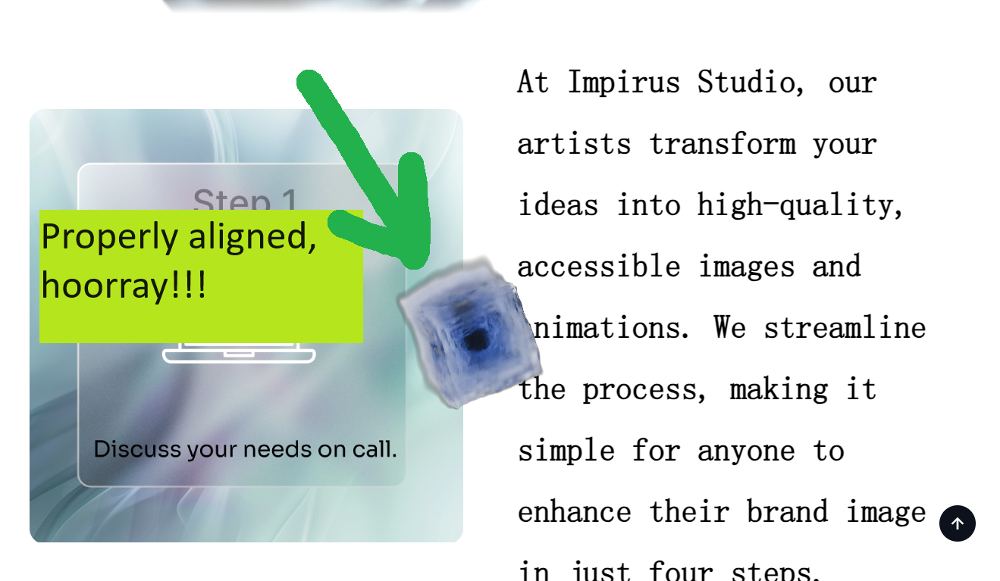
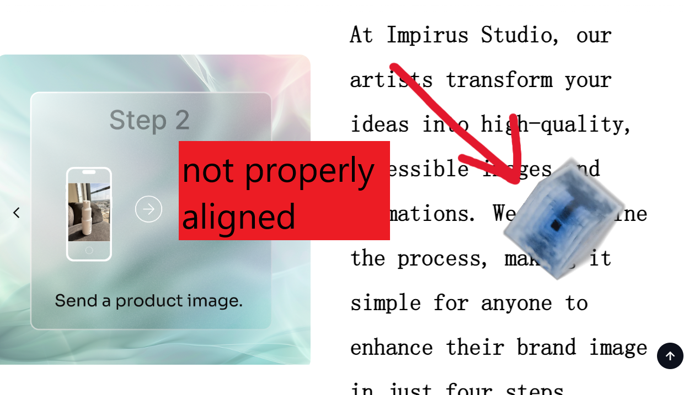

# Website Documentation
This file aims to explain different aspects of the website and how to add more content to it's different sub pages.

## Website Directory Structure 
`>` = directory/folder
```
> assets
    > based
    > livingThings
    > thumbnails
    > videos

> css
    about.css
    home.css
    modal.css
    projects.css
    shared.css

> documentation

> pages
    about.html
    home.html
    projects.html

> scripts
    about.js
    home.js
    modal.js
    projects.js
    scroll.js
    shared.js

index.css
index.html
```

## Directories and Important Files 

### >assets

This directory includes all images, fonts and videos to be used in the website.

>assets>based

Includes all images for the Based collaboration. 

>assets>livingThings

Includes all images for the Living Things collaboration. 

>assets>thumbnails

Includes all thumbnails for videos. Keep the sizes around 500x500 pixels for better performance. The aspect ratio can still be different for every video, so they do not have to be *exactly* 500x500. 

>assets>videos

Includes all the videos to be displayed. Always check the size of a video before you add it. I'm saying this since I know you export your renders in very high quality.

### >css
Includes all css files. Each page has it's own css file, these have the same name as their corresponding HTML-file. For example, `projects.css` belongs to `projects.html`. OBS, `home.css` is an exception of this rule, since `home.css` belongs to home.html. 

`shared.css` contains styling that is applied to every page. This file mostly contains styling for the navbar and footer.

`modal.css` contains styling for the modal (windows XP window). 

### >documentation
Contains documentation for the website.

### >pages
Contains the HTML-file for every page. The HTML contains the structure of the elements being shown on the website, but you know this already. 

`about.html` = contact page

`home.html` = home page

`projects.html` = projects page

### >scripts
Contains all JavaScript logic for the website. Every HTML-file has it's corresponding JavaScript file, similar to the css files. OBS, `home.js` is used for the home page (`home.html`).

`modal.js` contains all logic for the modal (windows XP window). 

`scroll.js` contains all logic for the smooth scrolling

`shared.js` contains logic used in every page. Mostly consists of navbar/footer logic.

### `index.css` and `index.html`
These files exist in the root folder of the project. They have been implemented to support our deployment of the website. They will only appear for a second before redirecting the user to the real home page (`home.html`). Nonetheless, ` `index.html` is the direct file that your domain leads to, even though it immediately redirects the user to `home.html`. 

## How to Add More Projects
You will complete more projects, and it's only natural that you will want to add these to the website. I have tried making the process as easy as possible, given our limitations. 

1. **Add All Needed Files**
All files need to be added to the `assets` folder. Make sure you have scaled all of your images so that they are a moderate size. Around 500x500 pixels is most optimal, 1500x1500 pixels should be the absolute max.

2. **Add the HTML for the New Project in `projects.html`**
First you must choose which group the project will be displayed within. For example, any element with the class `projectsGroup` is a classic group with three projects on every row. 



Then you can implement the project within your chosen group. Your project should be of the following structure:
```
<div class="projectDiv">
    
</div>
```

"image.jpg" will be the image displayed in the grid layout. 

OBS! The A and B values being used in the `openModal()` will later be replaced. 

3. **Add the Project to the `items` Array**
Adding the new project to the `items` array is the trickiest step. The array contains every project that can be displayed in the modal. 

This example aims to explain the structure of the array:
```
const items = 
[
    [ // item 1
        ['path to video in text', 'path to second image', 'path to third image'], // Each image/video will be it's own slide in the carousel
        "project title", 
        ["video description", "second img description", "third img description"],
        "A short text describing the media",
        ["thumbnail for video"] // Should not be included if there is no video!!
    ], // item 2
        ['path to image in text'], 
        "project title", 
        ["Project description"],
        "A short text describing the image",
    ]
    . . .  // (and so on)
]
```

You may have an item that has both videos and images. 

You may have an item with only one image or video

OBS! I have not yet tested if you can have multiple videos in one item, but it should work. 

Every element in the array contains the content needed to display a project in the modal. To clarify, all of the following code is what makes *a single project* that can be shown in the modal. 

```
[
    ['path to video in text', 'path to second image', 'path to third image'], // Each image/video will be it's own slide in the carousel
    "project title", 
    ["video description", "second img description", "third img description"],
    "A short text describing the media",
    ["thumbnail for video"] // Should not be included if there is no video!!
]
```

4. **Find out Which Index Your Project has in the Array**
The `items` array is an ordered list where every project has it's unique number. This number is known as the index of a project. The first project in the array, i.e. the first one added at the top, has the index 0. The second project has the index 1, the third project has the index 2 and so on. 

It's okay if you get it wrong, you will notice it later. 

5. **Circle Back to `projects.html` and add the Project Index**
In step 2, we used temporary placeholders which we called A and B. 

Replace A with your project index number.

Replace B with the slide you want to display.

B is the index number for which image/video you want to display first from your project. This index also starts at 0 and continues to 1, 2 etc. **If you only have one image/video/slide in your project, then B should be 0.**

If you have multiple images/videos/slides, then you can choose which slide should be displayed first. **For example, if you have three images/videos/slides and you want to display the second one first, then B should be 1.**

And with that, you should be done! If you enter the wrong index number for A or B then you will notice this when you open the modal. Try out different numbers if you're confused, you can always play around and see what happens!

## Deleting Projects
Removing projects is pretty much the same process as adding them but in reverse (you delete everything added from the previous step-by-step guide).

BUT! Do not remove the project from the `items` array. Keep it and life will be easier, trust me. Otherwise you would have to change every index number for every project to make up for the removed one. A single item in the array doesn't take much space since it's just text, so no worries on the performance department. 

## Adding Frosted Glass to an Element
To add the frosted glass effect to an element, simply add the `frostedGlass` class to your element in the HTML-file. 

Example usage:
```
<div class="frostedGlass"></div>
```

You can tweak the styling for the frosted glass inside `css>shared.css`.

## Adding Button Styling
There's a class defined that will make any button look like all the other buttons on the website. To use it, simply add the `button` class to your element (so far I've only used it on anchor elements (`<a>`)).

Example usage:
```
<a class="button"></a>
```

Additional styling may be needed.

## Adding Internal Links
Adding links to internal pages (that lead to pages WITHIN THIS website) can be done with an onclick method, like so:
```
onclick="redirectTo('./HTML file name')"
```

Example usage:

```
<a onclick="redirectTo('./about.html')">Contact us</a>
```

Using this method will allow the smooth page transitions that your website uses. 

## Adding External Links
Adding links to other websites (on the world wide web), such as LinkedIn or Google, should be done with a standard href attribute. 

Example usage:
```
<a href="https://twitter.com/impirus3d">Take me to the Impirus Twitter!</a>
```

## Adding Reviews
With time, you will also get more reviews that you may want to include in your website. Reviews can be either a *video review* or a *text review*. You could experiment and implement a review with both video and text, but you might need to add additional styling.

### Text Reviews
Adding a text review is pretty easy. 
1. **Add the Necessary Diles**
Add an image of the company logo in the `assets` folder. 

2. **Find the HTML Element in Which You Want to Place Your Review**
If you want to add your review to the home page, then search for the element with the class `reviewsContainer`. 

3. **Add the Required HTML Structure**
The structure should be like this:
```
<div class="reviewCard reviewCardOdd frostedGlass" style="background: rgba(0, 0, 0, 0.7);">
    <div class="companyImgContainer">
        
    </div>
    <div class="reviewText">
        <h3 class="clientName">Client name</h3>
        <h4 class="clientCompany">Founder of <i>Client company name</i></h4>
        <blockquote class="clientQuote" id="uniqueId"></blockquote>
    </div>
</div>
```

OBS! Replace all placeholder text, such as "Client company name". The image source from the example should be replaced with your own image. 

**uniqueId** should be replaced with your unique ID. This ID will be used to implement the quote from your client. 

4. **Navigate to >scripts>home.js**
5. **Implement the needed code**
Implement the following code:
```
const uniqueVariable = [
    "'My big quote'"
];

typewriter(uniqueVariable, "uniqueId");
```

OBS! Replace `uniqueVariable` with a unique name. Replace `uniqueId` with the same unique ID from step 2.

And you should be done!

### Video Reviews
1. **Add the Necessary Files**
Add an image of the company logo and the video review in the `assets` folder. Remember: all videos should go in the `videos` sub-directory. 
2. **Find the HTML Element in Which You Want to Place Your Review**
If you want to add your review to the home page, then search for the element with the class `reviewsContainer`. 

3. **Add the HTML Structure**
```
<div class="reviewCard reviewCardEven reviewCardVideo frostedGlass"  style="background: rgba(0, 0, 0, 0.7);">
    <div class="reviewText">
        <h3 class="clientName">Client name</h3>
        <h4 class="clientCompany"><i>Client company name</i>
        <video class="reviewVid" src="../assets/videos/myVideo.mp4" controls="" alt="A video review from Client company name" poster="../assets/thumbnails/myThumbnail.png"></video>
    </div>
    <div class="companyImgContainer">
        
    </div>
</div>
```

OBS! Replace all placeholder text, such as "Client company name". 

`poster="../assets/thumbnails/myThumbnail.png"` will decide the thumbnail of the video. Replace "myThumbnail.png" with your thumbnail. 

`src="../assets/videos/myVideo.mp4"` will implement the actual video. Replace "myVideo.mp4" with your video. 

Replace all sources from the example with your own sources. 

And you're done!

## Adding and applying fonts
Adding and replacing fonts is easy, but there can be more steps depending on the font. Some fonts can easily be accessed through Visual Studio Code (VSC), others you will have to import. If you are unsure whether a font exists within VSC or not, you can simply try to apply it to a random element. 

Try to apply "font-family: [insert font name];" to any element. If VSC suggests a font with the same name, then it already exists within VSC. Like so:



If it does not exist within VSC, then the app won't try suggesting something to you (or it will suggest something with a similar name), like so:



If you have found a niche artsy font, then chances are it does not exist within VSC. 

### Fonts within VSC
1. **Locate the element(s) you wish to change**
Locate the element(s) that you want to change. You can search for these elements in their respective HTML-files (use CTRL + F with the text content of the element).

If you want to change multiple elements at once, you can add a class to them. There are other ways of selecting elements, but they get more complex the deeper into the rabbit hole you get. If they already have a common class that's only specific to the elements you want to change, then you can utilize this class instead of adding a new one. 

If you only want to edit one element, then you can utilize it's ID, or add a new ID. 

2. **Navigate to the correct CSS file**
Different CSS files should contain different styling:
* If all of the elements are within the home page --> `home.css`

* If all of the elements are within the contact page --> `about.css`

* If all of the elements are within the projects page --> `projects.css`

* If all of the elements are within the modal (Windows XP window) --> `modal.css`

* If the elements scattered across multiple pages (for example the navbar) --> `shared.css`


3. **Select the element(s)**
Select the element(s) with the class name or ID name. When referencing IDs, use "#" as a prefix. When referencing classes, use "." as a prefix.

For example:

```
/* This is how you select an ID */
#someIDName{
    font-family: 'Gill Sans', 'Gill Sans MT', Calibri, 'Trebuchet MS', sans-serif;
}

/* This is how you select a class */
.someClassName{
    font-family: 'Times New Roman', Times, serif;
}
```

Replace the font name with your own font and you're done!

### Fonts outside of VSC
First read the steps to fonts within VSC to find out how to locate your elements and select the right CSS file. 

1. **Get the necessary files**

When implementing fonts outside of VSC, you need to add their files to the project. You will need the following files:


- font.eot
- font.svg
- font.ttf
- font.woff
- font.woff2

If you only have one file, for example the ".ttf" file, then that's okay! Simply convert the file to all of the other file types with an online tool, [such as this one](https://cloudconvert.com/ttf-to-woff). 

Add all of these files to the `assets` directory. 

2. **Import the font in shared.css**

You must import the font in `shared.css`.

Your import of the font should look something like this:

```
/* This block implements NSimSun!!! Do not remove */
@font-face {
    font-family: 'NSimSun';
    src: url('../assets/simsun.eot'); /* IE9 Compat Modes */
    src: url('../assets/simsun.eot?#iefix') format('embedded-opentype'), /* IE6-IE8 */
         url('../assets/simsun.woff2') format('woff2'), /* Super Modern Browsers */
         url('../assets/simsun.woff') format('woff'), /* Pretty Modern Browsers */
         url('../assets/simsun.ttf') format('truetype'), /* Safari, Android, iOS */
         url('../assets/simsun.svg#NSimSun') format('svg'); /* Legacy iOS, there should not be a hashtag in the actual file name, only this reference */
    font-weight: normal;
    font-style: normal;
}
```

OBS! Replace all file names with your own sources.

3. **Select your elements in the right CSS file**
Now you can add your font to elements normally (in the right CSS files of course)! For example:

```
p{
    font-family: NSimSun;
}
```

The name of the font will be the same one as the name you specified in your import. 

And you're done!

### If you want to change the font of ALL elements
Simply change the font applied to "body" in `shared.css`. 

```
*{
    margin: 0;
    padding: 0;
}
html{
    scroll-behavior: smooth;
}
body{
    width: 100vw;
    height: 100%;
    font-family: NSimSun;  <----- Change this!!!!
    outline: none;
    overflow-y: scroll !important;
}
```

### If you want to change the font of ALL elements in a specific page
Add a class to the body of a specific HTML-file. Then use that class name to target that specific body in it's corresponding css file. 

## Changing the transparent video (cube animation)

1. **Export two versions of your transparent video**

For this process, you will need two formats of your transparent video:
* Your video as a .mov-file
* Your video as a .webm-file

We need two versions of the same video for browser compatability. 

Both files need to be transparent! You cannot transform a video in html, so make sure they are already transparent. If you do not know how to make your video transparent, check out online converters as most of them work. For example, google something along the lines of "mov to webm no watermark" (so sorry but I don't remember which site I used...).  

*OBS! Make sure your files are SMALL, preferrably under 30 mb.*

When properly formatted and sized, these two files should be added to the `>assets>videos` directory.

2. **Delete the old transparent videos**

Now that you have your new videos, you should delete the previously used ones. If it is your first time changing the transparent video, then you should delete the files "cube.webm" and "cube.mov" from the same directory.

2. **Navigate to `home.html`**

To change the transparent video from the home page, navigate to `home.html`. 

3. **Edit the "vslAnimation" element**

This is the element we will be changing:
```
<div id="vslAnimation">
    <video id="sectionBackground" autoplay playsinline poster loop muted alt="render of a moving sphere">
        <source src="../assets/videos/cube.webm" type="video/webm">
        <source src="../assets/videos/cube.mov" type="video/mov">
    </video>
</div>
```

It contains two `<source>` elements, these will be the sources to your videos. 

The first source should be the path to your .webm-file. You may edit the path to use the file name of your new video.

For example, if my new .webm-file is called "donkey.webm" i will edit the first source to look like this:

```
<source src="../assets/videos/donkey.webm" type="video/webm">
```

The second source should be your .mov-file. You should edit the path to include your new .mov-file.

For example, if my .mov-file is called "hashbrown.mov", i will edit the source to look like this: 

```
<source src="../assets/videos/hashbrown.mov" type="video/mov">
```

And you're finished!

### If the transparent video is not aligned properly
If your new video does not have the same dimensions/size as the previous one, there is a chance that it will not be aligned properly. 




(The cube placement has been edited for demonstration)

In these cases, navigate to `home.css` and locate the following code:

```
#sectionBackground{
    position: absolute;
    opacity: 1;
    width: 140%;
    height: 240px;
    left: -75%;
    right: 0;
    top: -50vh;
    pointer-events: none;
}
```

Here you can adjust the positioning of the video. To adjust the positioning, simply play around with the *top/left* values (potentially *right* as well).

For some context, *vh* stands for viewport height. The viewport is the users screen. Vh works in percentage, so 100vh = 100% of the users screen height. 

*top* is currently set to -50vh. This means the cube is pushed **towards** the top by 50% of the viewport. 

If it were 50vh (not negative) then it would be pushed **away** from the top.

The math may become too convoluted if I explain everything in detail, so my best advice is for you to play around with it and see how it turns out!

**Just remember to also update the media queries** created for the same element (#sectionBackground). This is to make sure the cube is properly positioned **for every screen size** (mobile sizes can be ignored). 

The media queries will look something like this: 

```
@media screen and (max-width: 900px) {
    #sectionBackground{
        left: -92%;
    }
    . . . 
```

In this example, the media query declares that for screens smaller than 900px wide, the cube should be pushed -92% to the left. 

You can test varying screen sizes by opening the inspector, and dragging the size of the inspector window to make the inspector bigger, making the website smaller in return. 

Side note: You may have noticed it is impossible to click on the transparent video to inspect it. This is per design to avoid it blocking the carousel functionality, but you can still navigate to the video through inspecting other elements in the same area. 